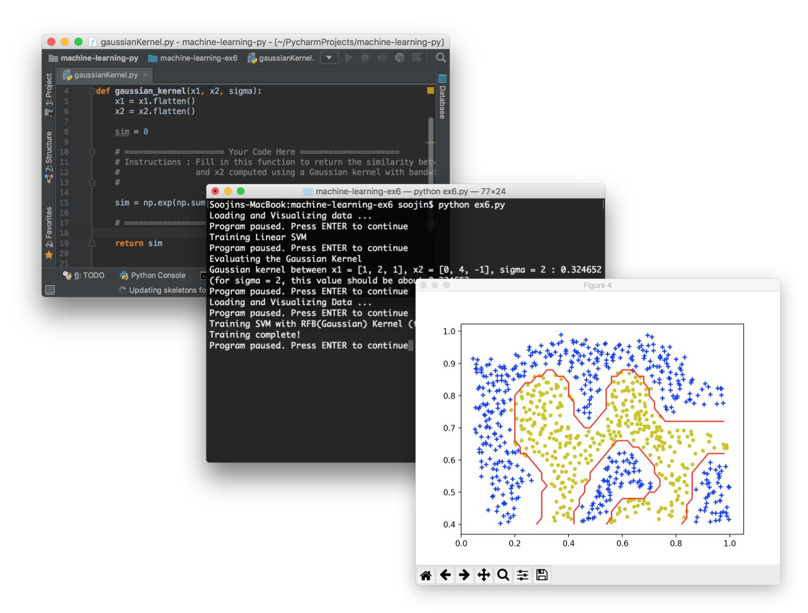

# Coursera Machine Learning Assignments in Python
[](https://www.linkedin.com/in/soojinro) []() []() []()



## About
If you've finished the amazing introductory Machine Learning on Coursera by Prof. Andrew Ng, you probably got familiar with Octave/Matlab programming. With this repo, you can re-implement them in Python, step-by-step, visually checking your work along the way, just as the course assignments.

## How to start
### Dependencies
This project was coded in Python 3.6
* numpy
* matplotlib
* scipy
* scikit-learn
* scikit-image
* nltk

### Installation
The fastest and easiest way to install all these dependencies at once is to use [Anaconda](https://www.continuum.io/downloads).


## Important Note
There are a couple of things to keep in mind before starting.
* all column vectors from octave/matlab are flattened into a simple 1-dimensional ndarray. (e.g., y's and thetas are no longer m x 1 matrix, just a 1-d ndarray with m elements.)
So in Octave/Matlab, 
    ```matlab
    >> size(theta)
    >> (2, 1)
    ```
    Now, it is
    ```python
    >>> theta.shape
    >>> (2, )
    ```
* numpy.matrix is never used, just plain ol' numpy.ndarray

## Contents
#### [Exercise 1](https://github.com/nsoojin/coursera-ml-py/tree/master/machine-learning-ex1)
* Linear Regression
* Linear Regression with multiple variables
#### [Exercise 2](https://github.com/nsoojin/coursera-ml-py/tree/master/machine-learning-ex2)
* Logistic Regression
* Logistic Regression with Regularization
#### [Exercise 3](https://github.com/nsoojin/coursera-ml-py/tree/master/machine-learning-ex3)
* Multiclass Classification
* Neural Networks Prediction fuction
#### [Exercise 4](https://github.com/nsoojin/coursera-ml-py/tree/master/machine-learning-ex4)
* Neural Networks Learning
#### [Exercise 5](https://github.com/nsoojin/coursera-ml-py/tree/master/machine-learning-ex5)
* Regularized Linear Regression
* Bias vs. Variance
#### [Exercise 6](https://github.com/nsoojin/coursera-ml-py/tree/master/machine-learning-ex6)
* Support Vector Machines
* Spam email Classifier
#### [Exercise 7](https://github.com/nsoojin/coursera-ml-py/tree/master/machine-learning-ex7)
* K-means Clustering
* Principal Component Analysis
#### [Exercise 8](https://github.com/nsoojin/coursera-ml-py/tree/master/machine-learning-ex8)
* Anomaly Detection
* Recommender Systems

## Solutions
You can check out my implementation of the assignments [here](https://github.com/nsoojin/coursera-ml-py-sj). I tried to vectorize all the solutions.
